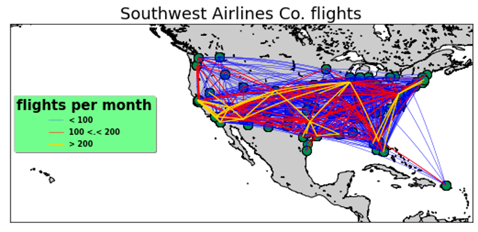
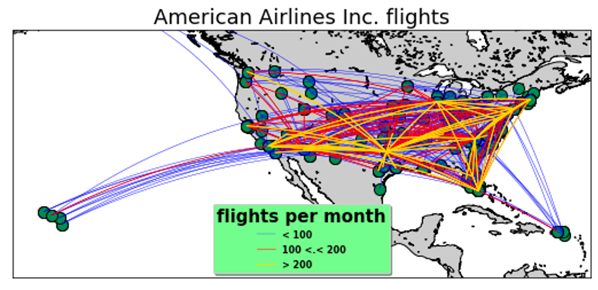
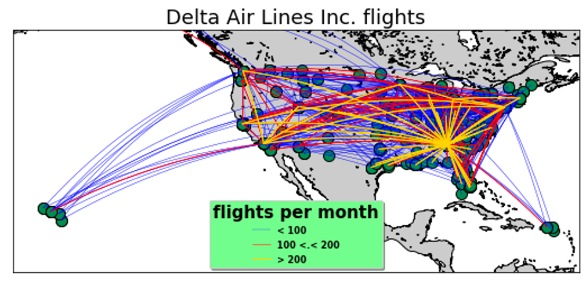
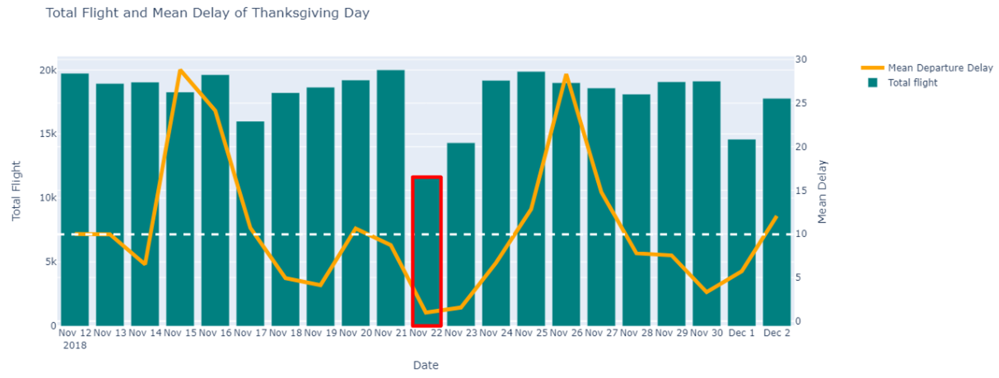
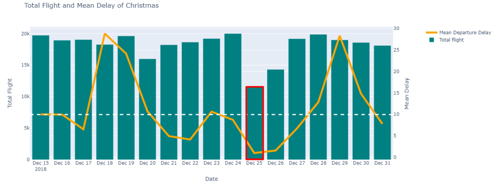
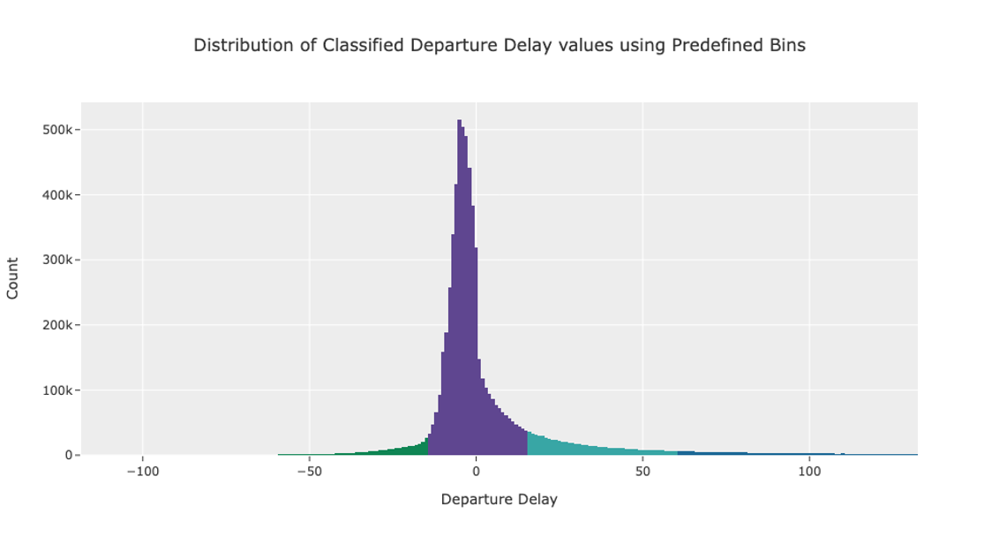
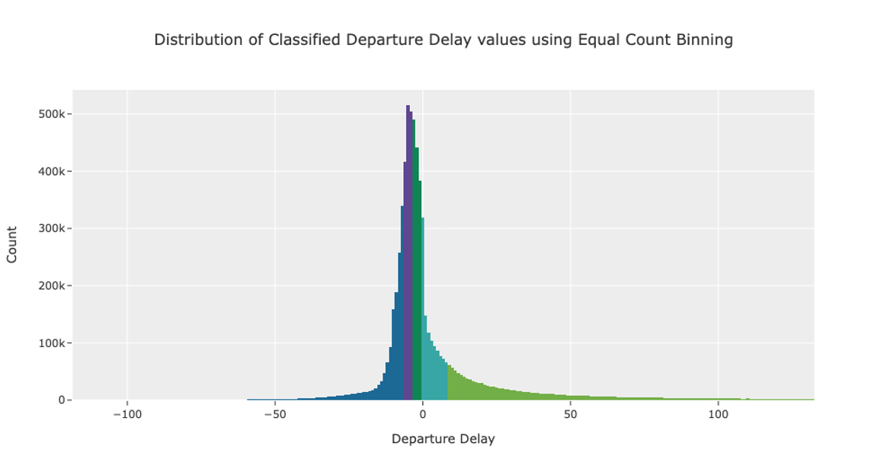

<div id="top"></div>

<!-- PROJECT LOGO -->
<br />
<div align="center">
  <h3 align="center">Predicting Flight Delays</h3>

  <p align="center">
    How can we better predict flight delays?
  </p>
</div>


<!-- TABLE OF CONTENTS -->
<details>
  <summary>Table of Contents</summary>
  <ol>
    <li><a href="#about-the-project">About The Project</a></li>
    <li><a href="#findings">Findings</a></li>
    <li><a href="#eda">EDA</a></li>
    <li><a href="#models">Models</a></li>
    <li><a href="#datasets">Datasets</a></li>
  </ol>
</details>


## About The Project

This project aims to uncover the underlying relationship between flight departure delays and extrinsic factors. Flight departure delay here is defined when a flight departs later than its scheduled time. In the project I narrowed to several specific factors, namely:
* `Airline` specific features such as reliability of airline
* `Airport` specific features such as airport traffic
* `Airplane` specific features such as airplane age
* `Weather` specific features such as precipitation, rainfall etc
* `Holiday` specific features

Refer <a href="#datasets">here</a> for a detailed breakdown of features from datasets and links to the dataset

### Motivations
Flight departure delays lead to unpleasant travel experiences for passengers while also incurring additional costs to airlines due to the relocation of crews and crafts and creating operational problems for airport management. 

Airline companies took the hardest hit during the pandemic due to travel bans and restrictions. As the pandemic eased into the new normal, reopening borders and relaxed travel restrictions are leading air travel back to pre-pandemic levels. In 2022, global passenger traffic increased significantly, reaching 77% of that in 2019. This trend is expected to continue this year in 2023. 

The problem of flight departure delays is becoming more relevant than ever before, as air travel is not only recovering from the pandemic, but is in fact increasing. An accurate flight departure delay prediction model is needed to solve this problem faced by customers and airlines.

<p align="right">(<a href="#top">back to top</a>)</p>


## Findings
1. `Delta Airlines` is the best airline in terms of reliability as it has operates a high number of flights and has a lower than average of departure delay against the industry
2. `Frontier Airlines` is the worst airline and has the highest delay amongst all the airlines. This could be probably due to the airlines small size, leading to lack of economies of scale, and its operation amongst smaller and inefficient airports
3. Using Fisher's Score, `Monthly Median Departure Delay`, `Origin Precipitation` and `Weather Code Intensity` were the top 3 most useful features in predicting departure delays.

<p align="right">(<a href="#top">back to top</a>)</p>

## Data Preprocessing

### Recommended Project Directory Setup
* As files are read using their relative paths, ensure you are following this project setup for smooth use
```
├── eda
├── models
├── preprocessing
    └── datasets
        ├── airline
            └── *.csv
        ├── airplane
            └── *.csv
        ├── airport
            └── *.csv
        ├── carrier
            └── *.csv
        ├── holidays
            └── *.csv
        └── weather
            └── *.csv
└── scripts
    ├── airline.py
    ├── airplane.py
    ├── airport.py
    ├── cleaned
        ├── cleaned_airline
            └── *.csv
        ├── cleaned_airplane
            └── *.csv
        ├── cleaned_airport
            └── *.csv
        ├── cleaned_holidays
            └── *.csv
        └── cleaned_weather
            └── *.csv
    ├── constants.py
    ├── helpers.py
    ├── holidays.py
    ├── merge.py
    ├── miner.py
    └── weather.py
```

* `eda/` contains the eda steps and uses the `eda_{year}.csv` dataset in `scripts/` created at the end of merging the various datasets
* `models/` contains the modelling steps and uses the `model_{year}.csv` dataset in `eda/` created at the end of EDA
* `preprocessing/` contains the specific preprocessing steps taken for each type of dataset
* `scripts/` contains the script used to automate the preprocessing steps taken for each type of dataset and apply it to the hundreds of datasets used, and subsequent joining of these cleaned datasets over an approximate 7 million rows for use in EDA

### Using the CLI
* Install dependencies `requirements.txt` into python environment
* Run `python miner.py` to interact with CLI

<p align="right">(<a href="#top">back to top</a>)</p>

## EDA

### Airline rankings in terms of their reliability 
* 5 airlines exceed the overall mean departure delay, including Southwest and American Airlines, where both have some of the highest numbers of flights
* In comparison to Delta Airlines which has the second-highest number of flights, it has a significantly lower mean departure delay of about four minutes below the overall mean departure delay. This is evident that the number of flights operated by an airline does not affect the mean departure delay
* From the geospatial analysis, we can see that Southwest Airlines has focused on operating on many routes on a low-frequency basis (few yellow lines and many blue lines) as opposed to American Airlines and Delta Airlines which focus on fewer routes but on a much higher frequency (fewer blue lines and more yellow lines). My suspicion is that in trying to cover many routes, Southwest Airlines exposes itself more to smaller airports that might have lower operational efficiency due to a lack of economies of scale. This might be why Southwest Airlines has a much higher mean departure delay than its counterparts.


> Relative count of flights made by each airline


> Mean delay of each airline compared with the industry mean


> Breakdown of type of delays by proportion for the top 5 most active airlines




> Geospatial analysis of flight network of Southwest, American and Delta Airline

<p align="right">(<a href="#top">back to top</a>)</p>

### Weather trends and Departure Delay
* No improvements after performing smoothing using 3 day rolling average
* Slight improvment when predicting monthly and weekly trends


> Before and after smoothing of weather features correlation matrix values


> Correlation Matrix Heatmap of Monthly Macro Weather Features


> Correlation Matrix Heatmap of Weekly Macro Weather Features

<p align="right">(<a href="#top">back to top</a>)</p>

### Impact of holidays on Departue Delays
* Thanksgiving and Christmas has the lowest mean delay
* Similar patterns were found where there are the highest mean delays and the total number of flights days before and after the actual holiday.


> Mean delay on each US holiday compared with total flights on that day



> Total Flight Frequency and Mean Delay of 10 days before and after Thanksgiving and Christmas Day respectively

<p align="right">(<a href="#top">back to top</a>)</p>

### Airport busy-ness and Departure Delays
* Smaller or less active airports seem to be less efficient as compared to bigger or busier ones


> Mean delay for each airport compared with total flights in and out of that airport

<p align="right">(<a href="#top">back to top</a>)</p>

### Creating a Multi-Class Classification Problem
I chose Multi-Class Classification over Regression as the approach, as it would help mitigate some of the unexplained variance by having to predict a category, that encapsulates a range of Departure Delay values over the precise Departure Delay value instead.

In performing a Multi-Class Classification approach, I had to first determine how I would categorise the Departure Delay continuous value into categorical classes. To create this categorisation, I formulated 2 ways:

| Custom Partitioning | Equal Count Partitioning |
| --- | --- |
| by predefining number of classes and class range | by predefining number of classes only |
| categorisation will be according to rule-based criteria, but number of data for each class may differ significantly as the categorisation is user-defined and does not necessarily take into account distribution of data. | categorisation will be be determined by distribution of data such that each class will have approximately the same amount of data. |
|  |  |

One main difference between the 2 methods is that for using Custom Partitioning, by predefining the number of classes and class range based on your own criteria, there is a high chance that there will be problems of `class imbalance` as the Departure Delays values are not evenly distributed in the first place, as seen by the purple class. However this can be corrected using SMOTE, where minority classes are artificially created by interpolating between existing instances.

### Choosing the Optimal Number of Classes
We also need to decide what is the optimal number of classes to use. Choosing the optimal number of classes requires a balance as having too few classes would result in a loss of value as classes are not as granular, while having too many classes would result in an increase in complexity as it would become harder to distinguish between classes.

Ultimately, through a process of trial and errors with model validation, I found that the optimal number of classes to have was 5. 

<p align="right">(<a href="#top">back to top</a>)</p>

## Models
From the EDA, it’s clear that there is only weak or no linear correlation between the explanatory variables and our target variables. As such, models which are able to capture nonlinear relationships are strongly preferred to linear classification models such as logistic regression

As such, the following models were used for `multi-class classification`
* Logistic Regression
* Random Forest Classifier
* XGBoost
* CatBoost
* Neural Networks

### Hyperparameter Tuning
In general, for XGBoost and CatBoost, focus was placed on the overfitting problem, which occurs more frequently with boosting models
| Random Forest | XGBoost | CatBoost |
| --- | --- | --- |
| `n_estimators`<br>Number of trees grown by the forest | `n_estimators`<br>Number of trees grown by the forest | `learning_rate`<br>Boosting rate of misclassified data |
| `max_depth`<br>Depth of each tree | `max_depth`<br>Depth of each tree | `l2_leaf_reg`<br>L2 regularization term, reduces overfitting |
| | `learning_rate`<br>Boosting rate of misclassified data | `depth`<br>Depth of each tree |
| | `gamma`, `reg_alpha`, `reg_lambda`<br>Reduce overfitting | |

### Performance
According to the key statistics (that is, early departure class precision and delayed departure class recall), the models trained on equal partitioning tend to perform worse than those trained on custom partitioning with SMOTE, with early precision of ~0.35 and late recall of about 0.2, compared to early combined precision of 0.6 and late combined recall of 0.5.

In comparison between models trained on the Custom Partitioned Dataset and SMOTE, the XGBoost model seems to perform the best, with combined early precision of 0.6 and combined late recall of 0.55. The ANN model performs the worst, with combined early precision of 0.48 and combined late recall of 0.33. The other two models, Random Forest and CatBoost, perform more similarly to the XGBoost model, but worse.


> XGBoost trained with the Custom Partitioning with SMOTE dataset was the highest performing model using a sample of 100,000 rows


> Using Fisher's Score, `Monthly Median Departure Delay`, `Origin Precipitation`, `Weather Code Intensity` was the Top 3 most impactful features.

<p align="right">(<a href="#top">back to top</a>)</p>

## Datasets
* Raw airlines dataset

`FL_DATE` = Date of the Flight<br>
`OP_CARRIER` = Airline Identifier<br>
`OP_CARRIER_FL_NUM` = Flight Number<br>
`ORIGIN` = Starting Airport Code<br>
`DEST` = Destination Airport Code<br>
`CRS_DEP_TIME`= Planned Departure Time<br>
`DEP_TIME` = Actual Departure Time<br>
`DEP_DELAY` = Total Delay on Departure in minutes<br>
`TAXI_OUT` = The time duration elapsed between departure from the origin airport gate and wheels off<br>
`WHEELS_OFF` = The time point that the aircraft's wheels leave the ground<br>
`WHEELS_ON` = The time point that the aircraft'ss wheels touch on the ground<br>
`TAXI_IN` = The time duration elapsed between wheels-on and gate arrival at the destination airport<br>
`CRS_ARR_TIME` = Planned arrival time<br>
`ARR_TIME` = Actual Arrival Time = ARRIVAL_TIME - SCHEDULED_ARRIVAL<br>
`ARR_DELAY` = Total Delay on Arrival in minutes<br>
`CANCELLED` = Flight Cancelled (1 = cancelled)<br>
`CANCELLATION_CODE` = Reason for Cancellation of flight: A - Airline/Carrier; B - Weather; C - National Air System; D - Security<br>
`DIVERTED` = Aircraft landed on different airport that the one scheduled<br>
`CRS_ELAPSED_TIME` = Planned time amount needed for the flight trip<br>
`ACTUAL_ELAPSED_TIME` = AIR_TIME+TAXI_IN+TAXI_OUT<br>
`AIR_TIME` = The time duration between wheels_off and wheels_on time<br>
`DISTANCE` = Distance between two airports<br>
`CARRIER_DELAY` = Delay caused by the airline in minutes<br>
`WEATHER_DELAY` = Delay caused by weather<br>
`NAS_DELAY` = Delay caused by air system<br>
`SECURITY_DELAY` = caused by security reasons<br>
`LATE_AIRCRAFT_DELAY` = Delay caused by security<br>

* Raw weather dataset

`weathercode` = The most severe weather condition on a given day (WMO code)<br>
`temperature_2m_max/min` = Maximum and minimum daily air temperature at 2 meters above ground (°C (°F))<br>
`apparent_temperature_max/min` = Maximum and minimum daily apparent temperature (°C (°F))<br>
`precipitation sum` = Sum of daily precipitation including rain, showers and snowfall (mm)<br>
`rain_sum` = Sum of daily rain (mm)<br>
`snowfall_sum` = Sum of daily snowfall (cm)<br>
`precipitation_hours` = The number of hours with rain (hours)<br>
`sunrise/set` = Sun rise and set times (iso8601)<br>
`windspeed_10m_max/windgusts_10m_max` = Maximum wind speed and gusts on a day (km/h)<br>
`winddirection_10m_dominant` = Dominant wind direction (°)<br>
`shortwave_radiation_sum` = The sum of solar radiation on a given day in Megajoules (MJ/m²)
`et0_fao_evapotranspiration` = Daily sum of ET₀ Reference Evapotranspiration of a well watered grass field (mm)<br> 

* Raw airplane dataset

`aircraft_type` = Type of aircraft
`aircraft_name` = Name of aircraft
`age` = Age of aircraft since its year of manufacture

* Raw airport dataset

`Airport` = Airport code
`TotalOperations` = Total count of flights coming in and out of the airport

<p align="right">(<a href="#top">back to top</a>)</p>
