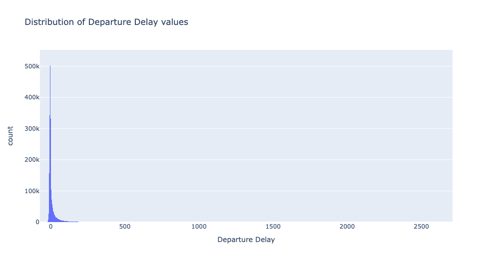
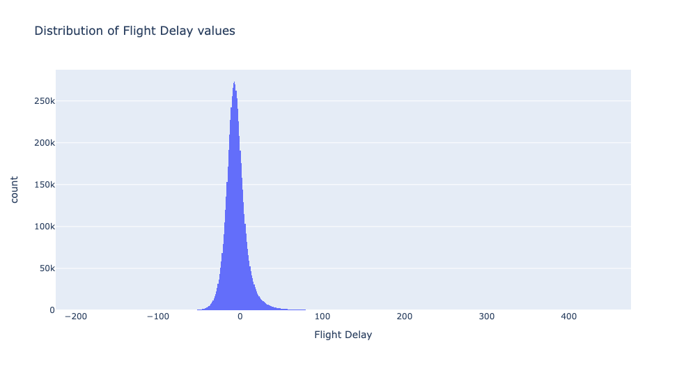

<div id="top"></div>

<!-- PROJECT LOGO -->
<br />
<div align="center">
  <h3 align="center">Predicting Flight Delays</h3>

  <p align="center">
    How can we better predict flight delays?
  </p>
</div>


<!-- TABLE OF CONTENTS -->
<details>
  <summary>Table of Contents</summary>
  <ol>
    <li><a href="#about-the-project">About The Project</a></li>
    <li><a href="#findings">Findings</a></li>
    <li><a href="#eda">EDA</a></li>
    <li><a href="#models">Models</a></li>
    <li><a href="#datasets">Datasets</a></li>
  </ol>
</details>


## About The Project

This project aims to uncover the underlying relationship with extrinsic factors that may exist between flight delays. Flight delay here is defined as the difference between the planned flight time and actual elapsed time. In the project we narrowed to several specific factors, namely:
* `Airline` specific features such as reliability of airline
* `Airport` specific features such as airport traffic
* `Airplane` specific features such as airplane age
* `Weather` specific features such as precipitation, rainfall etc

Refer <a href="#datasets">here</a> for a detailed breakdown of features from datasets and links to the dataset

### Motivations
Airline companies took the hardest hit during the pandemic due to travel bans and restrictions. As the pandemic eases into the new normal, reopening borders and relaxed travel restrictions is leading air travel back to pre pandemic levels. Given the sudden recovery and demand in travel, how can we help airlines better mitigate the negative impacts of flight delays so as to serve their customers better.

<p align="right">(<a href="#top">back to top</a>)</p>


## Findings


## Data Preprocessing

### Recommended Project Directory Setup
* As files are read using their relative paths, ensure you are following this project setup for smooth use
```
├── eda
├── models
├── preprocessing
    └── datasets
        ├── airline
            └── *.csv
        ├── airplane
            └── *.csv
        ├── airport
            └── *.csv
        ├── carrier
            └── *.csv
        ├── holidays
            └── *.csv
        └── weather
            └── *.csv
└── scripts
    ├── cleaned
        ├── cleaned_airline
            └── *.csv
        ├── cleaned_airplane
            └── *.csv
        ├── cleaned_airport
            └── *.csv
        ├── cleaned_holidays
            └── *.csv
        └── cleaned_weather
            └── *.csv
    ├── constants.py
    ├── helpers.py
    └── miner.py
```

* `eda/` contains the eda steps and uses the `eda_{year}.csv` dataset in `scripts/` created at the end of merging the various datasets
* `models/` contains the modelling steps and uses the `model_{year}.csv` dataset in `eda/` created at the end of EDA
* `preprocessing/` contains the specific preprocessing steps taken for each type of dataset
* `scripts/` contains the script used to automate the preprocessing steps taken for each type of dataset and apply it to the hundreds of datasets used, and subsequent joining of these cleaned datasets over an approximate 7 million rows for use in EDA

### Using the CLI
* Install dependencies `requirements.txt` into python environment
* Run `python miner.py` to interact with CLI


## EDA


> Histogram plot of Departure Delay values



> Histogram plot of Flight Delay values


### Class Imbalance
2 approaches were used to tackle the inherent class imbalance that exist within the dataset
1. Equal Size Binning of Classes
2. SMOTE

## Models
The following models were used for `multi-class classification`
* Logistic Regression
* Random Forest Classifier
* XGBoost
* CatBoost
* Neural Networks

### Performance

## Datasets
* Raw airlines dataset

`FL_DATE` = Date of the Flight<br>
`OP_CARRIER` = Airline Identifier<br>
`OP_CARRIER_FL_NUM` = Flight Number<br>
`ORIGIN` = Starting Airport Code<br>
`DEST` = Destination Airport Code<br>
`CRS_DEP_TIME`= Planned Departure Time<br>
`DEP_TIME` = Actual Departure Time<br>
`DEP_DELAY` = Total Delay on Departure in minutes<br>
`TAXI_OUT` = The time duration elapsed between departure from the origin airport gate and wheels off<br>
`WHEELS_OFF` = The time point that the aircraft's wheels leave the ground<br>
`WHEELS_ON` = The time point that the aircraft'ss wheels touch on the ground<br>
`TAXI_IN` = The time duration elapsed between wheels-on and gate arrival at the destination airport<br>
`CRS_ARR_TIME` = Planned arrival time<br>
`ARR_TIME` = Actual Arrival Time = ARRIVAL_TIME - SCHEDULED_ARRIVAL<br>
`ARR_DELAY` = Total Delay on Arrival in minutes<br>
`CANCELLED` = Flight Cancelled (1 = cancelled)<br>
`CANCELLATION_CODE` = Reason for Cancellation of flight: A - Airline/Carrier; B - Weather; C - National Air System; D - Security<br>
`DIVERTED` = Aircraft landed on different airport that the one scheduled<br>
`CRS_ELAPSED_TIME` = Planned time amount needed for the flight trip<br>
`ACTUAL_ELAPSED_TIME` = AIR_TIME+TAXI_IN+TAXI_OUT<br>
`AIR_TIME` = The time duration between wheels_off and wheels_on time<br>
`DISTANCE` = Distance between two airports<br>
`CARRIER_DELAY` = Delay caused by the airline in minutes<br>
`WEATHER_DELAY` = Delay caused by weather<br>
`NAS_DELAY` = Delay caused by air system<br>
`SECURITY_DELAY` = caused by security reasons<br>
`LATE_AIRCRAFT_DELAY` = Delay caused by security<br>

* Raw weather dataset

<p align="right">(<a href="#top">back to top</a>)</p>
