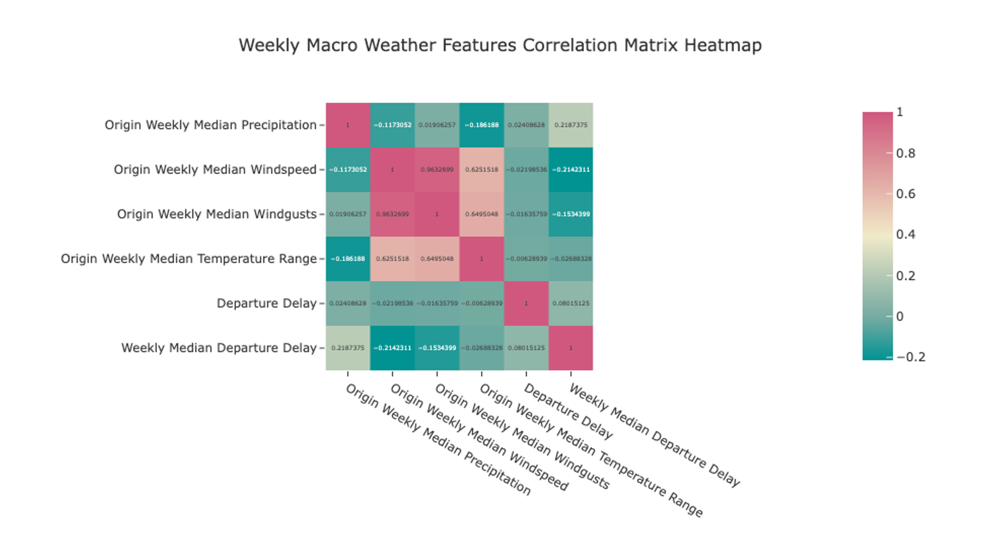

<div id="top"></div>

<!-- PROJECT LOGO -->
<br />
<div align="center">
  <h3 align="center">Predicting Flight Delays</h3>

  <p align="center">
    How can we better predict flight delays?
  </p>
</div>


<!-- TABLE OF CONTENTS -->
<details>
  <summary>Table of Contents</summary>
  <ol>
    <li><a href="#about-the-project">About The Project</a></li>
    <li><a href="#findings">Findings</a></li>
    <li><a href="#eda">EDA</a></li>
    <li><a href="#models">Models</a></li>
    <li><a href="#datasets">Datasets</a></li>
  </ol>
</details>


## About The Project

This project aims to uncover the underlying relationship with extrinsic factors that may exist between flight delays. Flight delay here is defined as the difference between the planned flight time and actual elapsed time. In the project we narrowed to several specific factors, namely:
* `Airline` specific features such as reliability of airline
* `Airport` specific features such as airport traffic
* `Airplane` specific features such as airplane age
* `Weather` specific features such as precipitation, rainfall etc

Refer <a href="#datasets">here</a> for a detailed breakdown of features from datasets and links to the dataset

### Motivations
Airline companies took the hardest hit during the pandemic due to travel bans and restrictions. As the pandemic eases into the new normal, reopening borders and relaxed travel restrictions is leading air travel back to pre pandemic levels. Given the sudden recovery and demand in travel, how can we help airlines better mitigate the negative impacts of flight delays so as to serve their customers better.

<p align="right">(<a href="#top">back to top</a>)</p>


## Findings
1. `Delta Airlines` is the best airline in terms of reliability as it has operates a high number of flights and has a lower than average of departure delay against the industry
2. `Frontier Airlines` is the worst airline and has the highest delay amongst all the airlines. This could be probably due to the airlines small size, leading to lack of economies of scale, and its operation amongst smaller and inefficient airports
3. `Monthly Median Departure Delay`, `Origin Precipitation` and `Weather Code Intensity` were the top 3 most useful features in predicting departure delays.

## Data Preprocessing

### Recommended Project Directory Setup
* As files are read using their relative paths, ensure you are following this project setup for smooth use
```
├── eda
├── models
├── preprocessing
    └── datasets
        ├── airline
            └── *.csv
        ├── airplane
            └── *.csv
        ├── airport
            └── *.csv
        ├── carrier
            └── *.csv
        ├── holidays
            └── *.csv
        └── weather
            └── *.csv
└── scripts
    ├── airline.py
    ├── airplane.py
    ├── airport.py
    ├── cleaned
        ├── cleaned_airline
            └── *.csv
        ├── cleaned_airplane
            └── *.csv
        ├── cleaned_airport
            └── *.csv
        ├── cleaned_holidays
            └── *.csv
        └── cleaned_weather
            └── *.csv
    ├── constants.py
    ├── helpers.py
    ├── holidays.py
    ├── merge.py
    ├── miner.py
    └── weather.py
```

* `eda/` contains the eda steps and uses the `eda_{year}.csv` dataset in `scripts/` created at the end of merging the various datasets
* `models/` contains the modelling steps and uses the `model_{year}.csv` dataset in `eda/` created at the end of EDA
* `preprocessing/` contains the specific preprocessing steps taken for each type of dataset
* `scripts/` contains the script used to automate the preprocessing steps taken for each type of dataset and apply it to the hundreds of datasets used, and subsequent joining of these cleaned datasets over an approximate 7 million rows for use in EDA

### Using the CLI
* Install dependencies `requirements.txt` into python environment
* Run `python miner.py` to interact with CLI


## EDA

### Airline rankings in terms of their reliability 
* Delta Airlines which is one of the biggest or most active airline has one of the lowest mean delay


> Relative count of flights made by each airline


> Mean delay of each airline compared with the industry mean


> Breakdown of type of delays by proportion for the top 5 most active airlines


### Weather trends and Departure Delay
* No improvements after performing smoothing using 3 day rolling average
* Slight improvment when predicting monthly and weekly trends


> Before and after smoothing of weather features correlation matrix values


> Correlation Matrix Heatmap of Monthly Macro Weather Features



> Correlation Matrix Heatmap of Weekly Macro Weather Features

### Impact of holidays on Departue Delays
* Thanksgiving and X'mas has the lowest mean delay


> Mean delay on each US holiday compared with total flights on that day

### Airport busy-ness and Departure Delays
* Smaller or less active airports seem to be less efficient as compared to bigger or busier ones


> Mean delay for each airport compared with total flights in and out of that airport

### Class Imbalance
2 approaches were used to tackle the inherent class imbalance that exist within the dataset
1. Equal Size Binning of Classes
   * predefine number of bins only
   * sorts and equally split rows across the specified number of bins such that each bin has an equal number of rows
2. SMOTE
   * predefine number of bins and range values of each bin
   * artifically creates minority classes by interpolating existing instances 

## Models
The following models were used for `multi-class classification`
* Logistic Regression
* Random Forest Classifier
* XGBoost
* CatBoost
* Neural Networks

### Hyperparameter Tuning
| Random Forest | XGBoost | CatBoost |
| --- | --- | --- |
| `n_estimators`<br>Number of trees grown by the forest | `n_estimators`<br>Number of trees grown by the forest | `learning_rate`<br>Boosting rate of misclassified data |
| `max_depth`<br>Depth of each tree | `max_depth`<br>Depth of each tree | `l2_leaf_reg`<br>L2 regularization term, reduces overfitting |
| | `learning_rate`<br>Boosting rate of misclassified data | `depth`<br>Depth of each tree |
| | `gamma`, `reg_alpha`, `reg_lambda`<br>Reduce overfitting | |

### Performance


> XGBoost trained with the SMOTE dataset was the highest performing model 


> Fisher's Score of features

## Datasets
* Raw airlines dataset

`FL_DATE` = Date of the Flight<br>
`OP_CARRIER` = Airline Identifier<br>
`OP_CARRIER_FL_NUM` = Flight Number<br>
`ORIGIN` = Starting Airport Code<br>
`DEST` = Destination Airport Code<br>
`CRS_DEP_TIME`= Planned Departure Time<br>
`DEP_TIME` = Actual Departure Time<br>
`DEP_DELAY` = Total Delay on Departure in minutes<br>
`TAXI_OUT` = The time duration elapsed between departure from the origin airport gate and wheels off<br>
`WHEELS_OFF` = The time point that the aircraft's wheels leave the ground<br>
`WHEELS_ON` = The time point that the aircraft'ss wheels touch on the ground<br>
`TAXI_IN` = The time duration elapsed between wheels-on and gate arrival at the destination airport<br>
`CRS_ARR_TIME` = Planned arrival time<br>
`ARR_TIME` = Actual Arrival Time = ARRIVAL_TIME - SCHEDULED_ARRIVAL<br>
`ARR_DELAY` = Total Delay on Arrival in minutes<br>
`CANCELLED` = Flight Cancelled (1 = cancelled)<br>
`CANCELLATION_CODE` = Reason for Cancellation of flight: A - Airline/Carrier; B - Weather; C - National Air System; D - Security<br>
`DIVERTED` = Aircraft landed on different airport that the one scheduled<br>
`CRS_ELAPSED_TIME` = Planned time amount needed for the flight trip<br>
`ACTUAL_ELAPSED_TIME` = AIR_TIME+TAXI_IN+TAXI_OUT<br>
`AIR_TIME` = The time duration between wheels_off and wheels_on time<br>
`DISTANCE` = Distance between two airports<br>
`CARRIER_DELAY` = Delay caused by the airline in minutes<br>
`WEATHER_DELAY` = Delay caused by weather<br>
`NAS_DELAY` = Delay caused by air system<br>
`SECURITY_DELAY` = caused by security reasons<br>
`LATE_AIRCRAFT_DELAY` = Delay caused by security<br>

* Raw weather dataset

`weathercode` = The most severe weather condition on a given day (WMO code)<br>
`temperature_2m_max/min` = Maximum and minimum daily air temperature at 2 meters above ground (°C (°F))<br>
`apparent_temperature_max/min` = Maximum and minimum daily apparent temperature (°C (°F))<br>
`precipitation sum` = Sum of daily precipitation including rain, showers and snowfall (mm)<br>
`rain_sum` = Sum of daily rain (mm)<br>
`snowfall_sum` = Sum of daily snowfall (cm)<br>
`precipitation_hours` = The number of hours with rain (hours)<br>
`sunrise/set` = Sun rise and set times (iso8601)<br>
`windspeed_10m_max/windgusts_10m_max` = Maximum wind speed and gusts on a day (km/h)<br>
`winddirection_10m_dominant` = Dominant wind direction (°)<br>
`shortwave_radiation_sum` = The sum of solar radiation on a given day in Megajoules (MJ/m²)
`et0_fao_evapotranspiration` = Daily sum of ET₀ Reference Evapotranspiration of a well watered grass field (mm)<br> 

* Raw airplane dataset

`aircraft_type` = Type of aircraft
`aircraft_name` = Name of aircraft
`age` = Age of aircraft since its year of manufacture

* Raw airport dataset

`Airport` = Airport code
`TotalOperations` = Total count of flights coming in and out of the airport

<p align="right">(<a href="#top">back to top</a>)</p>
